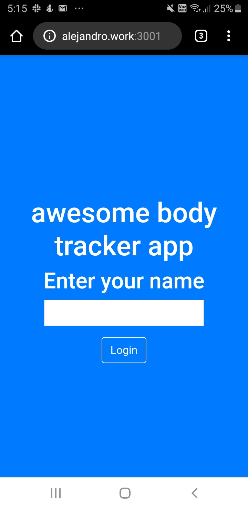
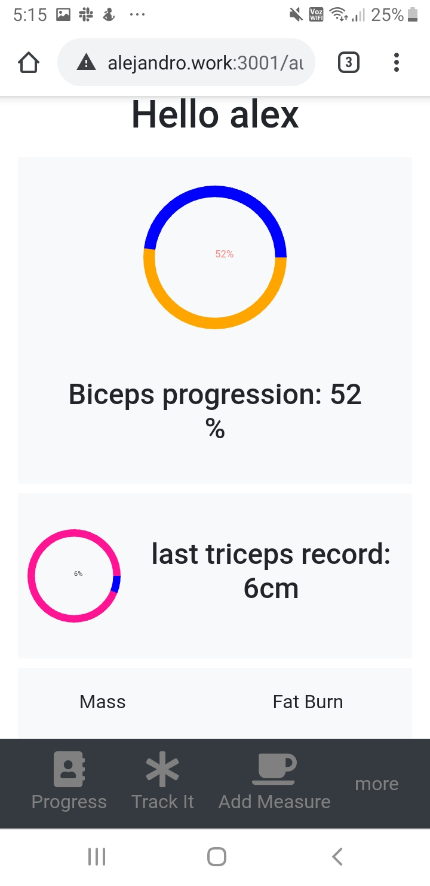
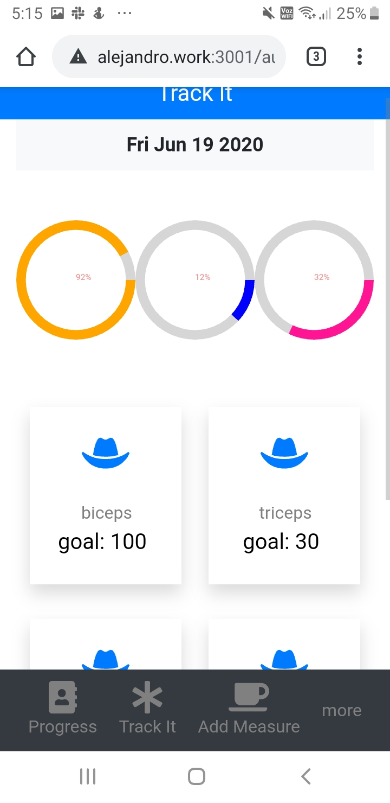
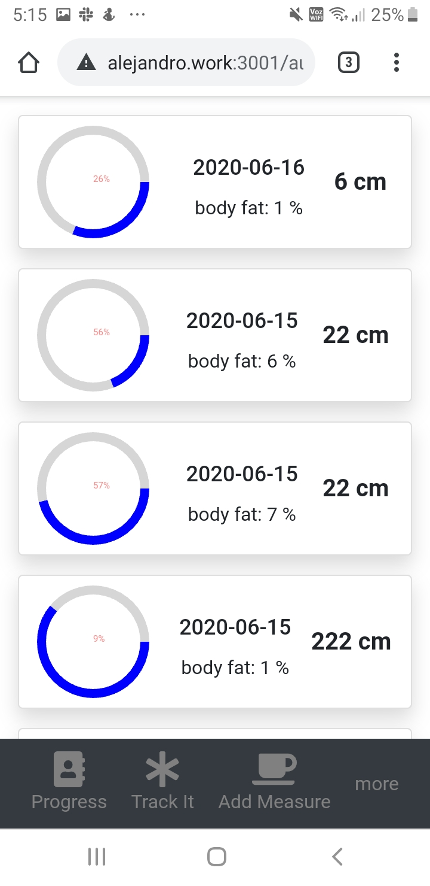
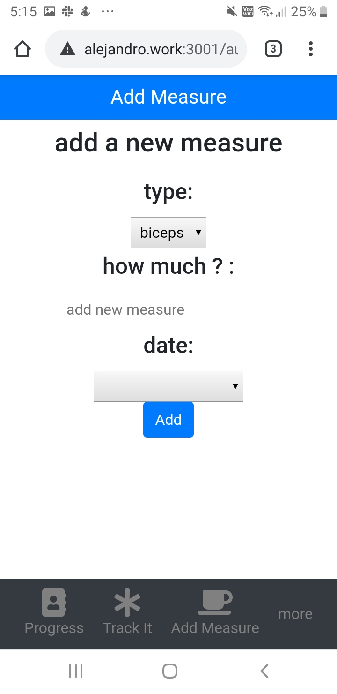

[![Contributors][contributors-shield]][contributors-url]

[![Forks][forks-shield]][forks-url]
[![Stargazers][stars-shield]][stars-url]

[![Issues][issues-shield]][issues-url]
[![MIT License][license-shield]][license-url]

# Awesome Body Tracker
 

  

  <h3 align="center">
    A Capstone project from the  Microverse React-Redux Curriculum
  </h3>

  <h3 align="center">
	 Live Version link - http://www.alejandro.work:3001
  </h3>

 

  

## Project 'Awesome Body Tracker'

This app allows you to keep a daily log of different body part measures. So you can keep a log and track every item to hit your target.

You can see charts of your overall progress (by default it shows you biceps and triceps on the Progress tab) and also a detailed view of every record when you go to the Bodypart section.

This app is built with React for the frontend and It hits an API endpoint built with Rails that you can find [here](www.github.com/alexawesomecode/awesome-body-api/)

# Design

## Login

This the first screen you see when browsing. 

## Progress

Next you are moved to the 'Progress' page where you can see some stats about your progress.

## Track it

Here you are faced with all the items you are tracking. If you click on them you are redirected to the items details.

## Track Card Detail

This is a list of items with time details.

## Add measure

Here you can add measure. You choose the item and value.

## 
# Validations

- ESLINT
- Stylelint

# Get Started

Download or clone this [repo here](https://github.com/alexawesomecode/awesome-body-tracker), enter the main folder and do `npm install` followed by `npm start`. 

The you go to http://localhost:3000

You need to setup also the backend. Go [here](www.github.com/alexawesomecode/awesome-body-api/) for instructions.

# Built With

This project was built with these techologies:

* React + Redux
* Javascript
* ES6
* Lodash
* Webpack & Babel
* HTML
* CSS3

# Authors

**Alejandro Andres**

- Github: [@alexawesomecode](https://github.com/alexawesomecode)
- Twitter: [@alexcode0](https://twitter.com/alexcode0)
- Linkedin: [Alejandro Andres](https://www.linkedin.com/in/alejandro-andres-126592191/)

# License

This project is licensed under the MIT License - see the [LICENSE.md](LICENSE.md) file for details

<!-- ACKNOWLEDGEMENTS -->
## Acknowledgements
* [Microverse](https://www.microverse.org/)

<!-- MARKDOWN LINKS & IMAGES -->
<!-- https://www.markdownguide.org/basic-syntax/#reference-style-links -->
[contributors-shield]: https://img.shields.io/github/contributors/alexawesomecode/awesome-body-tracker.svg?style=flat-square
[contributors-url]: https://github.com/alexawesomecode/awesome-body-tracker/graphs/contributors
[forks-shield]: https://img.shields.io/github/forks/alexawesomecode/awesome-body-tracker
[forks-url]: https://github.com/alexawesomecode/awesome-body-tracker/network/members
[stars-shield]: https://img.shields.io/github/stars/alexawesomecode/awesome-body-tracker
[stars-url]: https://github.com/alexawesomecode/awesome-body-tracker/stargazers
[issues-shield]: https://img.shields.io/github/issues/alexawesomecode/awesome-body-tracker
[issues-url]: https://github.com/alexawesomecode/awesome-body-tracker/issues
[license-shield]: https://img.shields.io/github/license/alexawesomecode/awesome-body-tracker
[license-url]: https://github.com/alexawesomecode/awesome-body-tracker/blob/master/LICENSE.txt
